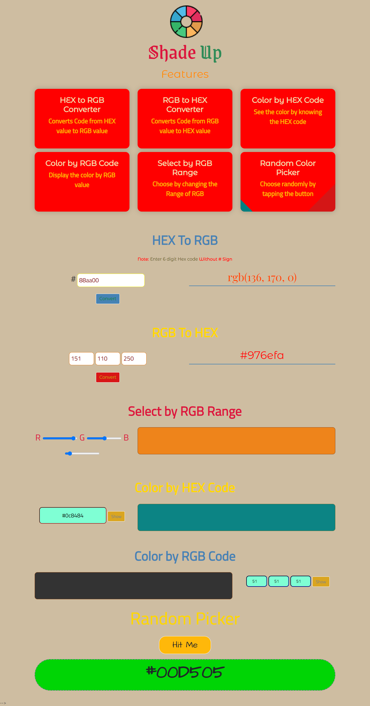

# PRANAV MATHUR

## Learnings from the project:

- Converting Hex colour to RGB using _slice_ and _parseInt_ methods

## Time taken:

    It took me 3 hours to complete this project.

## Screenshots:

## Live link:

[Go to site](https://12-shade-up.netlify.app/)
